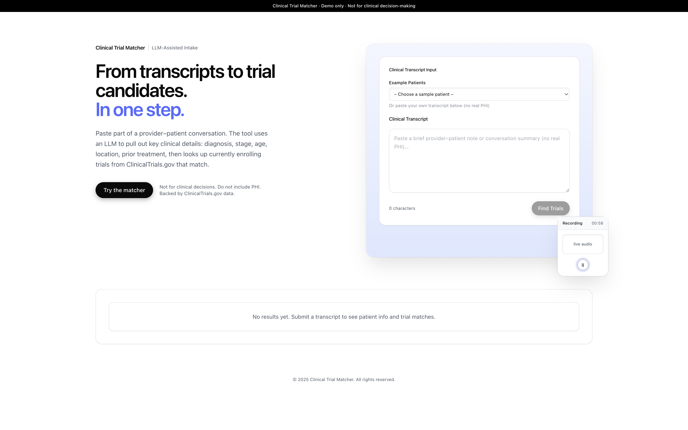
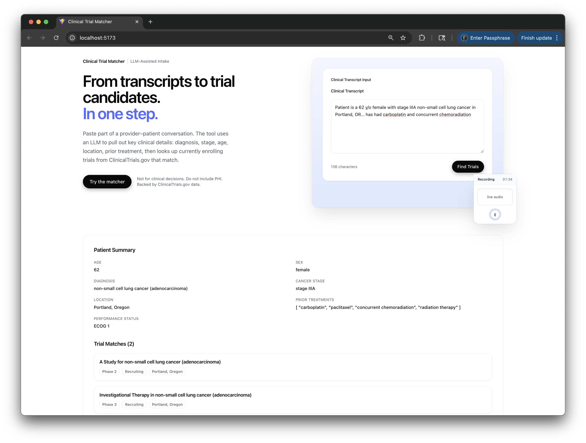

# Clinical Trial Matcher

Live demo:  
**Frontend:** https://clinical-trial-matcher-frontend.vercel.app  
**Backend API:** https://clinical-trial-matcher-api.onrender.com/api/match  

> Demo only — Do not enter real patient data (no PHI).  
> Uses mock transcripts and deterministic extraction logic for safe public display.
---
## Overview

This demo simulates an **AI-assisted clinical intake system** that converts a provider–patient transcript into structured clinical data and automatically matches relevant clinical trials from [ClinicalTrials.gov](https://clinicaltrials.gov).

It models how clinicians could interact with an AI scribe, verifying, correcting, and rerunning trial searches on the validated data.

---

## 💡 Key Features

### 1. Transcript → AI Extraction
Users paste or select a sample clinical transcript.  
The backend extracts patient attributes such as:

- Age, sex  
- Diagnosis and cancer stage  
- Location / travel willingness  
- Prior treatments  
- ECOG performance status  

### 2. Human-in-the-Loop Verification 🔁
After extraction, the **Patient Profile (review & correct)** form appears.  
Clinicians can edit any field before running a final match.  
Clicking **Re-run match with corrected info** posts the clinician-verified data to `/api/matchFromPatientData`, skipping the LLM and re-querying trials.

### 3. Multiple Sample Patients 🧬
You can pick from several realistic oncology transcripts:

| Patient | Condition | Location |
|----------|------------|-----------|
| **Maria (62F)** | Stage IIIA NSCLC (post-chemoradiation) | Portland, OR |
| **James (71M)** | Recurrent prostate cancer (rising PSA) | Salem, OR |
| **Aisha (44F)** | Metastatic HER2+ breast cancer | Seattle, WA |

Each generates structured data and trials reflecting their case.

### 4. Safe Mock Mode
The backend gracefully falls back to deterministic patient data when the LLM key is absent, allowing the demo to run without real PHI or OpenAI calls.

---

## Architecture
Transcript
↓
extractPatientData() ← LLM / mock logic
↓
searchTrials() ← ClinicalTrials.gov API
↓
ClinicalTrials.gov API query
↓
Frontend React UI ← Editable clinician interface


**Stack:**
- **Backend:** Node.js + Express + TypeScript  
- **Frontend:** React + Vite + TailwindCSS  
- **Deployment:** Render (API) + Vercel (Frontend)

---

## Environment Setup

### 1. Backend (`/backend/.env`)
  Create a `.env` file in `/backend`:
  ```env
  OPENAI_API_KEY=sk-key-here
  MOCK_MODE=false
  PORT=5050
  ```

### 2. Frontend (`/frontend/.env`) 
  VITE_API_BASE=https://clinical-trial-matcher-api.onrender.com

### 3. Local Run
  # backend
  cd backend
  npm install
  npm run dev

  # frontend
  cd frontend
  npm install
  npm run dev

## Deployment
  - **Backend:** Render (Node Web Service)
  Environment variables configured in Render Dashboard.
  Public endpoint: /api/match

  - **Frontend:** Vercel (React app)
  Environment variable VITE_API_BASE points to the Render URL.

## Example
  **Input Transcript**
  Hi doctor, I'm a 62 year old woman with stage III non-small cell lung cancer in Portland, Oregon.
  I'm currently on carboplatin and paclitaxel but still progressing.
  I'm tired and short of breath. I'm interested in clinical trials nearby if possible.
  
  **Response**
  {
    "patientData": {
    "age": "62",
    "sex": "female",
    "diagnosis": "non-small cell lung cancer",
    "cancer_stage": "III",
    "location": "Portland, Oregon",
    "prior_treatments": "carboplatin and paclitaxel",
    "performance_status": "short of breath, fatigued"
   },
   "trials": [
    {
      "nct_id": "NCT-DEMO-001",
      "title": "Phase II Carboplatin + Novel Immunotherapy in Stage III NSCLC",
      "phase": "II",
      "status": "Recruiting",
      "locations": ["Portland, OR"]
    }
   ],
   "note": "LLM quota exceeded in production; returning demo data instead of live model output."
  }

## Current Features
  - End-to-end working demo (frontend + backend)
  - OpenAI-powered extraction (gracefully degrades if quota reached)
  - Fetches and filters trials from ClinicalTrials.gov
  - CORS-secured API (Render ⇆ Vercel)
  - Clear, minimal light UI with transcript input + structured output

## Future Improvements
  - Real LLM integration with OpenAI for extraction
  - Semantic ranking of trials (vector search)
  - Save / export trial lists
  - “Ask about this trial” chat interface
  - Role-based authentication for provider vs patient view

## Screenshots
  ### 1. Entering a transcript
  The clinician (or assistant) can paste a portion of the provider–patient conversation. The tool extracts diagnosis, stage, age, location, and treatment history using an LLM, and warns not to include PHI.
  
  
  ### 2. Patient summary + trial matches
  The app shows a structured patient summary and a ranked list of currently enrolling trials from ClinicalTrials.gov, including why each trial might be relevant (e.g. "stage IIIA NSCLC", "Portland, OR").
  


  **Backend API (Postman)**
  .png)
